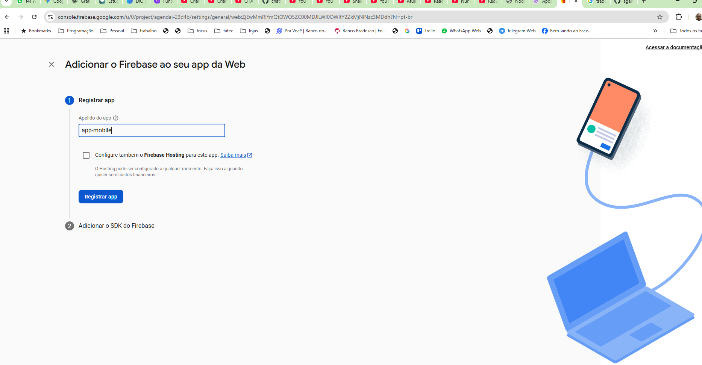

# agendai
projeto utilizado para aulas de desenvolvimento mobile - Fatec 2025


---
criar um registro firebase

driar um modulo : databas no projeto
criar um modulo : servide como api no projeto

aplicar em 
login - a funcao login
registro  - registro
dashboard - finalizar login

- aplicar controle de rotas , so deixar acessar o dashboar com o login feito;


---
criando autorização para o app


---

insira um nome para o app


  * click em **registrar app**
---
3. conclusão do registro:


----
```bash
   npm install firebase
```

```js
// Import the functions you need from the SDKs you need
import { initializeApp } from "firebase/app";
// TODO: Add SDKs for Firebase products that you want to use
// https://firebase.google.com/docs/web/setup#available-libraries

// Your web app's Firebase configuration
const firebaseConfig = {
  apiKey: "AIzaS",
  authDomain: "agendai",
  projectId: "agendai",
  storageBucket: "agendai.app",
  messagingSenderId: "0213",
  appId: "1:64cfc"
};

// Initialize Firebase
const app = initializeApp(firebaseConfig);
```

yarn add @react-native-firebase/app @react-native-firebase/auth
# ou
npm install @react-native-firebase/app @react-native-firebase/auth


npm remove @react-native-firebase/app

npm remove @react-native-firebase/auth


crie um arquivo firebase-config.ts
```js
```

crie um arquivo auth-firebase.ts
```js
```

erro:
 ERROR  Error: Native module RNFBAppModule not found. Re-check module install, linking, configuration, build and install steps., js engine: hermes


  "@react-native-firebase/auth",
      "@react-native-firebase/app"


# Para Android
npx expo run:android

# Para iOS (requer macOS e Xcode)
npx expo run:ios


eas build --profile development --platform all


```bash
Android Bundled 4470ms node_modules\expo-router\entry.js (3055 modules)
 WARN  [2025-11-03T12:38:30.468Z]  @firebase/auth: Auth (12.5.0):
You are initializing Firebase Auth for React Native without providing
AsyncStorage. Auth state will default to memory persistence and will not
persist between sessions. In order to persist auth state, install the package
"@react-native-async-storage/async-storage" and provide it to
initializeAuth:

import { initializeAuth, getReactNativePersistence } from 'firebase/auth';
import ReactNativeAsyncStorage from '@react-native-async-storage/async-storage';
const auth = initializeAuth(app, {
  persistence: getReactNativePersistence(ReactNativeAsyncStorage)
});

```